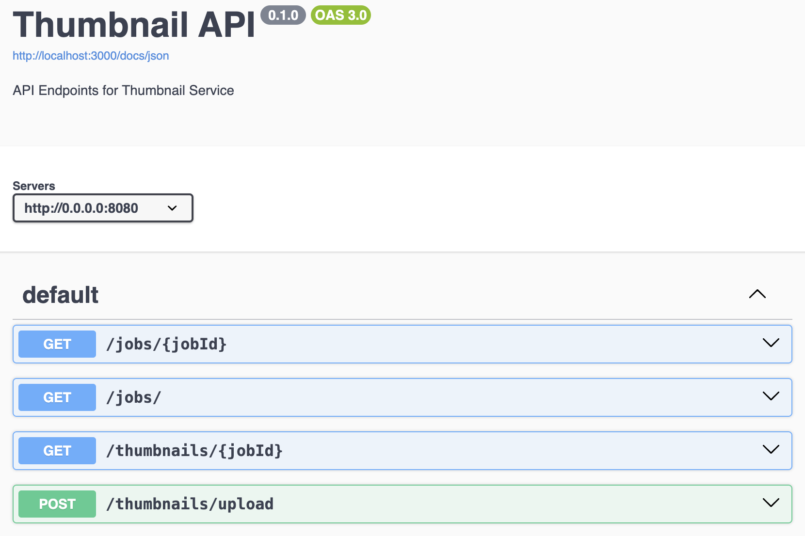
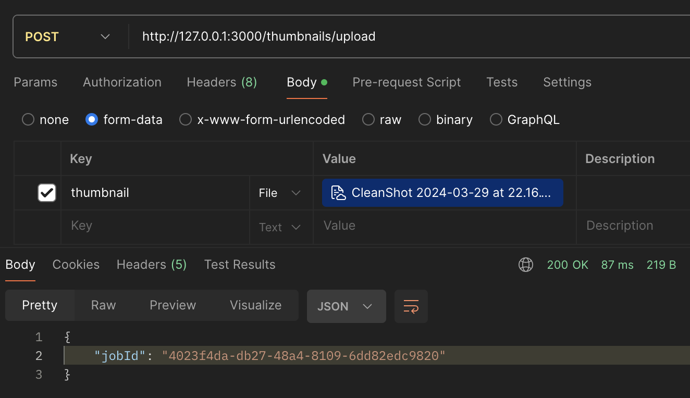
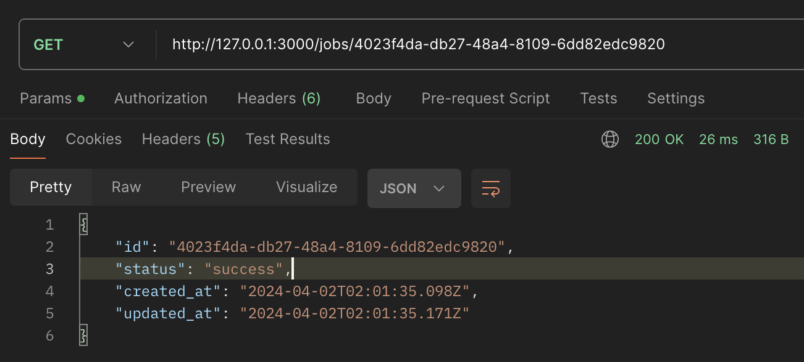
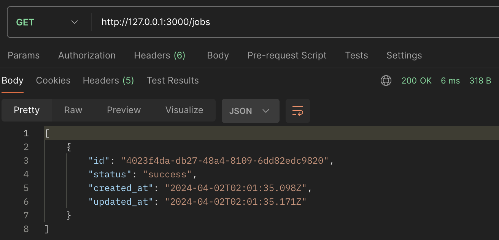
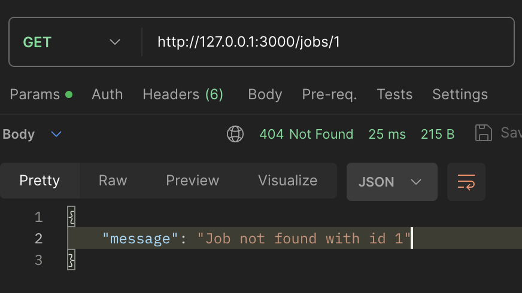
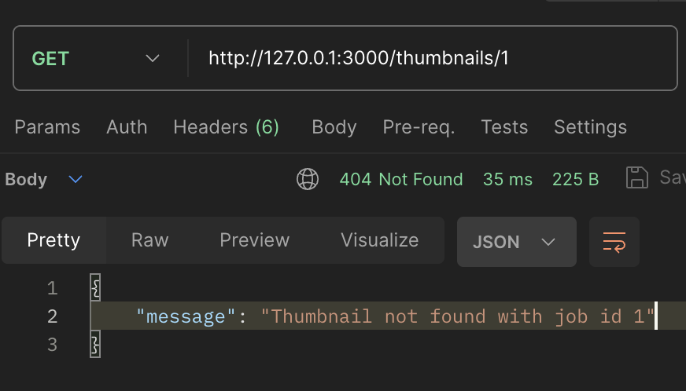
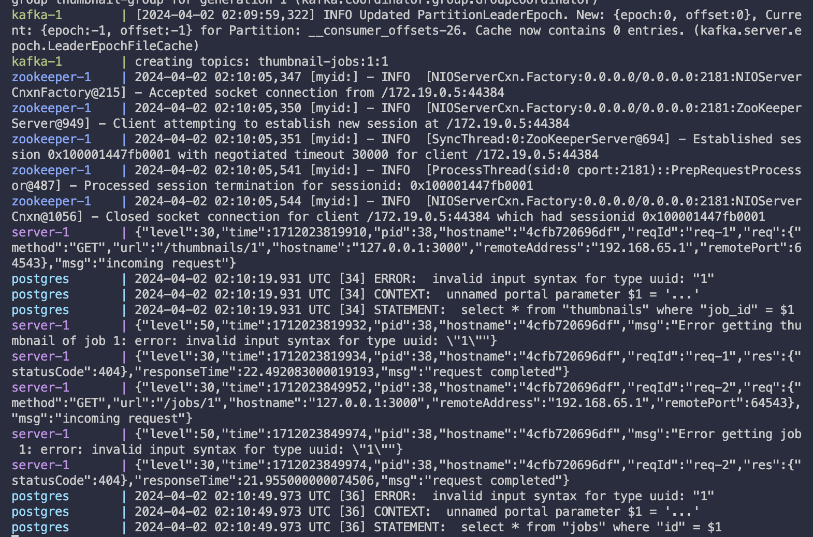
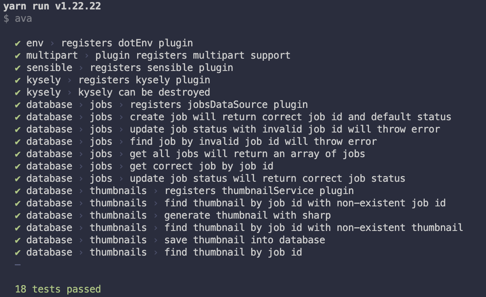

# Thumbnail-API

## Highlights

**Fastify(Node.js Framework)** + **Sharp (thumbnail generation)** + **Apache Kafka** + **WebP (output thumbnail format)** = Complete generating **500** thumbnails in under **5 seconds**!

_Note: this project only uses single pool & topic queue of kafka, which to say, the output time can even be much lower in a production setup!_

## Before Start

### Framework/Tools:

- node.js w/ TypeScript, w/ [fastify framework](https://fastify.dev/)
- sharp -> generating thumbnail
- Apache Kafka -> supports long-running jobs
- postgreSQL
- docker
- [Local Kubernetes with kind, Helm & Dashboard](https://medium.com/@munza/local-kubernetes-with-kind-helm-dashboard-41152e4b3b3d)
- Unit testing: [AVA](https://github.com/avajs/ava?tab=readme-ov-file)
- Logger: [Pino](https://github.com/pinojs/pino) (bound with fastify by default)

### Generating thumbnail performance

[sharp vs jimp](https://www.peterbe.com/plog/sharp-vs-jimp)

### Implementation of creating long-running jobs?

We do have several options:

- Job Queue/Task Queue System (e.g., RabbitMQ, Apache Kafka, Redis Queue)
- Background Job/Task Processing Library (e.g., Celery, Bull, Agenda)
- Serverless/cloud function

Considering the project requirements of potential high scalability, I'm going with **Job Queue/Task Queue System** - Apache Kafka.
Kafka is good at:

- Advanced messaging features like message routing, redelivery, various messaging patterns >> Redis Queue
- Highly scalable systems >> Redis Queue, RabbitMQ
- Growing community
- Highly reliable and fualt-tolerant, able to handle failures seamlessly

### Logger: Pino

- excellent performance
- good defaults, with not much extra configuration
- highly customizable
- structured logging in JSON

### Unit Testing: AVA

- easy to use, install in one line
- parallel test running
- native ES6/7 support
- built-in support for async functions
- automatically ends promise by itself if promise is returned
- offers snapshots
- built-in assertions

### Thumbnail storage format: WebP

> WebP lossless images are [26% smaller](https://developers.google.com/speed/webp/docs/webp_lossless_alpha_study#results) in size compared to PNGs. WebP lossy images are [25-34% smaller](https://developers.google.com/speed/webp/docs/webp_study) than comparable JPEG images at equivalent [SSIM](https://en.wikipedia.org/wiki/Structural_similarity) quality index.
> Lossless WebP **supports transparency** (also known as alpha channel) at a cost of just [22% additional bytes](https://developers.google.com/speed/webp/docs/webp_lossless_alpha_study#results).

Referenced from [WebP: # An image format for the Web](https://developers.google.com/speed/webp#:~:text=WebP%20lossless%20images%20are%2026,of%20just%2022%25%20additional%20bytes.)

## Install Instructions

1. Docker (**Recommend**)  
   Becaue this container involves local kafka, different than usual production, would recommend this app simply by:  
   `docker compose up`

2. Helm  
   Use `thumbnail-api-chart-0.1.0.tgz`  
   _The kafka docker image used in this project might NOT be compatitable with kubernetes manifests_

## APIs

**Swagger** is introduced:

**Preview**:

1. `thumbnails/upload`
   

2. `jobs/{{id}}`
   

3. `jobs/`
   

**Note**:
Output thumbnail is in webP format, so you need to fetch like this:  
`curl http://127.0.0.1:3000/thumbnails/{{jobId}} --output {{name}}.webp`

**Error message examples**

1. `invalid job`
   

2. `invalid thumbnail`
   

## Logger Preview

**Includes libraries debug info, plus extra manually involved warning and error messages**
 
 

## Unit Tests

Run tests by `yarn test` or `npm test`

## Current Trade-offs

1. Due to limitation on local kafka container, this project doesn't include end-to-end tests (purely testing through api calls)
2. Some post processing or corner cases steps might be left behind
3. To save local storage size, uploaded orgininal image is cached temporarily, which is going to be deleted after job been processed
4. Set a size limit on uploaded image, so generated thumbnail saving to database as bytea type is storage effective

## Future Improvements (Go Production)

1. Use s3 for production storage deploy and use better storage strategy
2. Duplicated uploaded image detection
3. Allow user to give self-defined name (like slack)
4. Add security layer and multi users support
5. Tighter and solid unit tests
6. Other strategy to subscribe to kafka queue status instead of W/R database?
